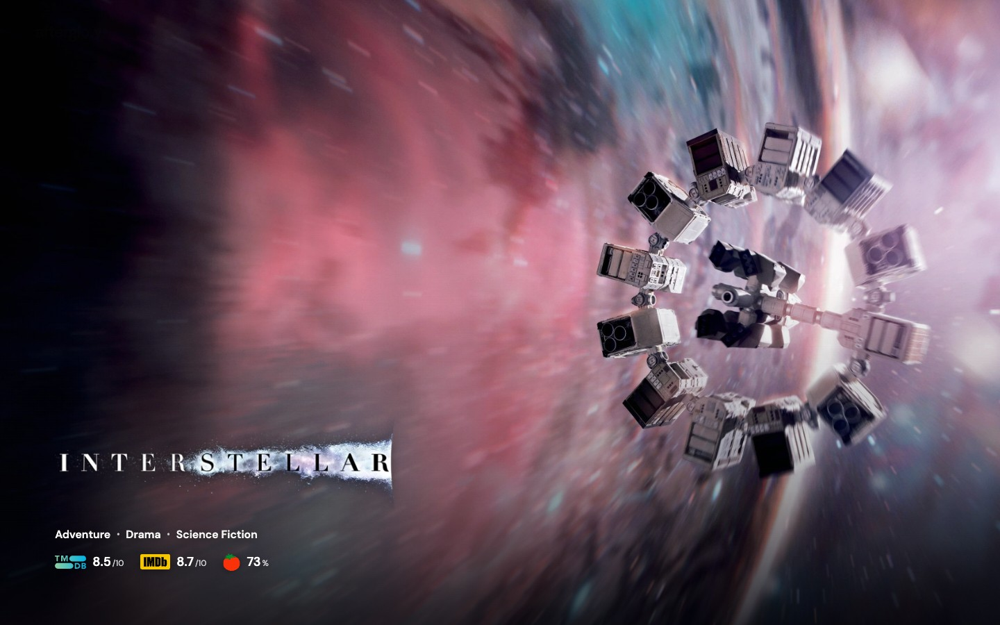
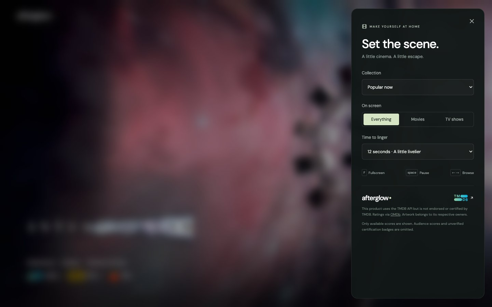

<div align="center">

# afterglow ◦

### A quiet screen. A world of cinema.

An endless, cinematic movie & TV screensaver for your browser.<br>
Full-bleed artwork. Original title logos. Nothing in the way.

[](https://github.com/ashermenachem/afterglow/actions/workflows/ci.yml)
[](LICENSE)
[](https://nodejs.org/)

**[Run locally](#run-it-on-your-laptop)** · **[Controls](#make-yourself-at-home)** · **[How it works](#behind-the-scenes)**

</div>



## Let the screen wander

Turn your laptop or spare monitor into a window onto cinema. Afterglow moves through movies and television with gentle camera movement and smooth dissolves. Move your pointer to browse or change the mood; step away and the controls disappear.

- **Cinema, edge to edge.** High-resolution backdrops and transparent title artwork, with a clean text fallback.
- **A little context.** Up to three genres and available TMDb, IMDb and Rotten Tomatoes critic scores.
- **Your kind of evening.** Popular now, daily and weekly trending, top rated, or shuffle. Movies, TV, or both.
- **Room to linger.** Choose 12, 20 or 30 seconds per title. Pause, skip and enter fullscreen whenever you like.
- **Made for the long view.** Upcoming artwork preloads, the feed keeps paging, and it cycles when it reaches the end.
- **Thoughtful defaults.** Hidden idle controls, reduced-motion support, remembered preferences and a screen wake lock where supported.

No account is needed to use a hosted copy. Running your own copy requires your own API keys.

## Run it on your laptop

### 1. Get the project

Install [Node.js 22 or newer](https://nodejs.org/) and [Git](https://git-scm.com/downloads), then open a terminal:

```sh
git clone https://github.com/ashermenachem/afterglow.git
cd afterglow
npm ci
```

Prefer not to use Git? Choose **Code → Download ZIP**, unzip it, open a terminal in that folder and run `npm ci`.

### 2. Add your own keys

Get a [TMDb API key](https://www.themoviedb.org/settings/api) and an [OMDb API key](https://www.omdbapi.com/apikey.aspx). Account registration may be required by those providers.

Copy `.env.example` to `.env`:

```sh
# macOS / Linux
cp .env.example .env
```

```powershell
# Windows PowerShell
Copy-Item .env.example .env
```

Open `.env` in a text editor and replace the placeholders:

```dotenv
TMDB_API_KEY=your_tmdb_api_key
OMDB_API_KEY=your_omdb_api_key
PORT=4173
```

Use TMDb's **API key (v3 auth)**, not its API Read Access Token. Keys stay on the server. Never commit `.env` or prefix a key with `VITE_`.

### 3. Start the scene

```sh
npm run dev
```

Open **[localhost:4173](http://localhost:4173)** and press **F** for fullscreen. Keep the terminal running; **Ctrl+C** stops the server.

For an optimized local build:

```sh
npm run build
npm start
```

On macOS, after adding your keys, you can also double-click **Launch Afterglow.command**. It installs dependencies/builds if needed and opens the site. The local server listens only on your laptop.

## Make yourself at home

| Control | Action |
| --- | --- |
| `F` | Enter / leave fullscreen |
| `Space` | Pause / resume |
| `←` / `→` | Previous / next title |
| `Esc` | Close settings / leave fullscreen |
| Pointer movement | Reveal controls for three seconds |

<details>
<summary><strong>A peek at the settings</strong></summary>
<br>



</details>

## Behind the scenes

**React + TypeScript + Vite** render the screensaver. A small **Express** API keeps provider credentials off the client. On Vercel, the frontend is static and the API runs as a serverless function; the same app runs locally without a hosting account.

TMDb supplies artwork, title logos, genres, rankings and ratings. Movies and TV are merged by popularity for **Popular now** or by rating for **Top rated**, which requires at least 300 votes. Trending follows TMDb's ranking; Shuffle randomizes each weekly-trending page. Titles are deduplicated and unsuitable or failed artwork is skipped.

OMDb supplies IMDb and Rotten Tomatoes critic scores where available. Missing ratings are omitted rather than invented. A critic score of 60% or more uses the fresh tomato; lower scores use the splat. **Audience scores and certification badges are not included**: the available API does not reliably supply that information, and certification cannot be inferred from a percentage alone.

Feeds are cached for one hour; metadata and ratings for 24 hours. Public responses are cached on Vercel's CDN. Server memory is bounded, upstream requests are concurrency-limited, and uncached API requests are rate-limited per instance. Provider quotas still apply. Local metadata is periodically saved to `.cache/`; Vercel instances use memory and CDN caching, not persistent local disk.

Afterglow is a website, not an installed operating-system screensaver. Fullscreen and keeping the display awake depend on browser support. Artwork quality and logo availability vary by title.

## Deploy your own

1. Fork this repository and import it into [Vercel](https://vercel.com/new).
2. Keep the included Vite build configuration.
3. Add `TMDB_API_KEY` and `OMDB_API_KEY` as **sensitive environment variables** in Vercel. Do not upload your `.env` file.
4. Deploy. The Git integration automatically deploys changes pushed to the production branch and creates previews for other branches.

Use your own provider keys and review their quotas/terms before making a public instance. Never put keys into GitHub Actions files, browser code, issue reports or screenshots.

## Development

```sh
npm test                 # Ratings and server-side checks
npm run build            # TypeScript check + production bundle
npm run check:secrets     # Check tracked files before publishing
npm run test:e2e          # Browser checks; local server must be running
```

Local browser tests use installed Google Chrome. CI installs Chromium and tests with stubbed provider responses, so **no API secrets are needed in GitHub Actions**.

Small, focused contributions are welcome. See [CONTRIBUTING.md](CONTRIBUTING.md) and [SECURITY.md](SECURITY.md). If Afterglow makes your screen a little better, a star helps other people find it.

---

<sub>Code is [MIT licensed](LICENSE). Movie/TV artwork, logos and trademarks belong to their respective owners and are not included in the code license. Data and images: [TMDb](https://www.themoviedb.org). Additional ratings: [OMDb](https://www.omdbapi.com). Critic icons and [rating rules](https://www.rottentomatoes.com/about): Rotten Tomatoes. Interface font: DM Sans. Afterglow is not affiliated with Netflix, IMDb or Rotten Tomatoes.</sub>

<sub>This product uses the TMDB API but is not endorsed or certified by TMDB.</sub>
